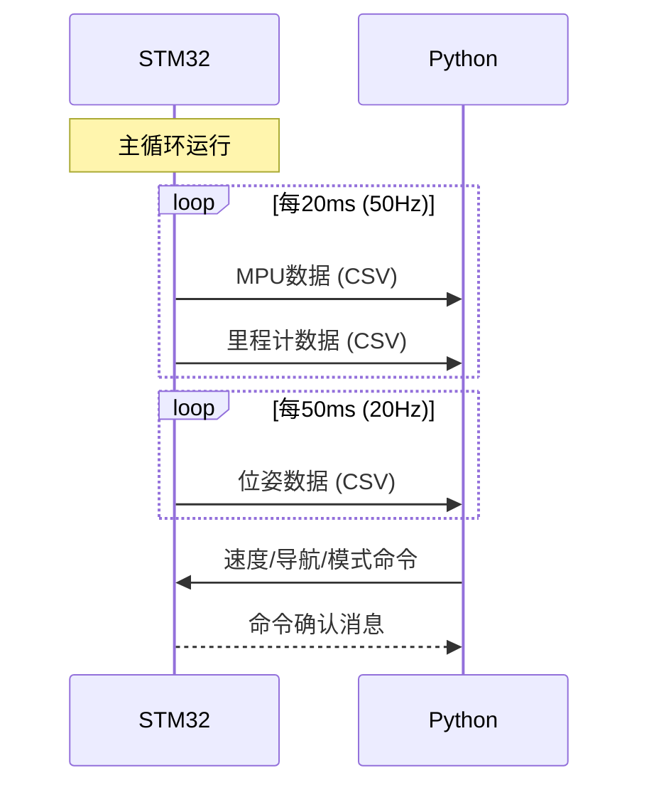
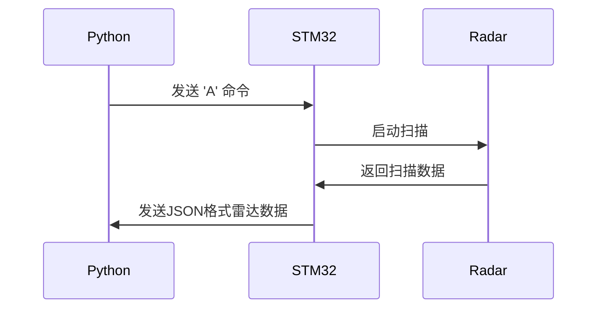

# 硬件通信协议详细说明

## 📡 概述

本文档详细描述了STM32硬件端（xxq/Core/Src/main.c）与Python软件端之间的通信协议。

---

## 📤 硬件端发送的数据（STM32 → Python）

硬件端通过 **UART4** 周期性地向Python主机发送以下4种类型的传感器数据：

### 1. MPU6500
姿态数据（CSV格式）

**发送频率**: 50Hz（每20ms一次）

**格式**: 
```
MPU,timestamp,roll,pitch,ax,ay,az,gx,gy,gz
```

**字段说明**:
| 字段 | 类型 | 单位 | 说明 |
|------|------|------|------|
| `MPU` | 固定标识符 | - | 数据类型标识 |
| `timestamp` | unsigned long | 毫秒 | HAL_GetTick()获取的系统时间戳 |
| `roll` | float (%.2f) | 度 | 横滚角 |
| `pitch` | float (%.2f) | 度 | 俯仰角 |
| `ax` | float (%.3f) | m/s² | X轴加速度 |
| `ay` | float (%.3f) | m/s² | Y轴加速度 |
| `az` | float (%.3f) | m/s² | Z轴加速度 |
| `gx` | float (%.2f) | °/s | X轴角速度 |
| `gy` | float (%.2f) | °/s | Y轴角速度 |
| `gz` | float (%.2f) | °/s | Z轴角速度 |

**示例**:
```
MPU,12345,2.34,-1.56,0.123,0.045,9.765,0.12,-0.34,0.56
```

**代码位置**: `main.c:1294-1301`

---

### 2. 里程计数据（CSV格式）

**发送频率**: 50Hz（每20ms一次）

**格式**:
```
ODO,timestamp,left_rps,right_rps,left_count,right_count
```

**字段说明**:
| 字段 | 类型 | 单位 | 说明 |
|------|------|------|------|
| `ODO` | 固定标识符 | - | 数据类型标识 |
| `timestamp` | unsigned long | 毫秒 | 系统时间戳 |
| `left_rps` | float (%.2f) | 转/秒 | 左轮实际速度（转速） |
| `right_rps` | float (%.2f) | 转/秒 | 右轮实际速度（转速） |
| `left_count` | long | 脉冲数 | 左轮编码器累计计数 |
| `right_count` | long | 脉冲数 | 右轮编码器累计计数 |

**示例**:
```
ODO,12365,1.50,1.52,15600,7800
```

**代码位置**: `main.c:1306-1313`

---

### 3. 位姿估计数据（CSV格式）

**发送频率**: 20Hz（每50ms一次）

**格式**:
```
POSE,timestamp,x,y,theta
```

**字段说明**:
| 字段 | 类型 | 单位 | 说明 |
|------|------|------|------|
| `POSE` | 固定标识符 | - | 数据类型标识 |
| `timestamp` | unsigned long | 毫秒 | 系统时间戳 |
| `x` | float (%.3f) | 米 | X坐标（融合IMU+里程计） |
| `y` | float (%.3f) | 米 | Y坐标（融合IMU+里程计） |
| `theta` | float (%.2f) | 弧度 | 航向角（0为正前方） |

**示例**:
```
POSE,12415,0.125,0.345,1.57
```

**代码位置**: `main.c:1318-1324`

**备注**: 该位姿由位姿估计器融合IMU和里程计数据计算得出

---

### 4. 激光雷达数据（JSON格式）

**发送频率**: 按需（收到'A'命令后）

**格式**:
```json
{
  "type": "LIDAR",
  "timestamp": 12500,
  "data": {
    "total_points": 360,
    "angle_coverage": 360.0,
    "sectors": [
      {
        "sector_id": 0,
        "angle_center": 0,
        "count": 45,
        "min_dist": 0.15,
        "avg_dist": 0.87
      },
      ... // 共8个扇区（0-7）
    ]
  }
}
```

**字段说明**:
| 字段 | 类型 | 单位 | 说明 |
|------|------|------|------|
| `type` | string | - | 固定为"LIDAR" |
| `timestamp` | unsigned long | 毫秒 | 系统时间戳 |
| `total_points` | unsigned long | 个 | 有效测量点总数 |
| `angle_coverage` | float (%.1f) | 度 | 角度覆盖范围 |
| `sectors[].sector_id` | int | - | 扇区编号（0-7，每个45°） |
| `sectors[].angle_center` | int | 度 | 扇区中心角度（0°,45°,...,315°） |
| `sectors[].count` | unsigned long | 个 | 该扇区测量点数 |
| `sectors[].min_dist` | float (%.2f) | 米 | 该扇区最小距离 |
| `sectors[].avg_dist` | float (%.2f) | 米 | 该扇区平均距离 |

**代码位置**: `main.c:1264-1289`

---

## 📥 硬件端接收的命令（Python → STM32）

硬件端通过 **UART4** 接收来自Python主机的以下命令：

### 1. 导航控制命令

**格式**: 
```
NAV,x,y,theta,speed\n
```

**参数说明**:
| 参数 | 类型 | 单位 | 说明 |
|------|------|------|------|
| `x` | float | 米 | 目标X坐标 |
| `y` | float | 米 | 目标Y坐标 |
| `theta` | float | 度 | 目标朝向角 |
| `speed` | float | 转/秒 | 目标速度（RPS） |

**示例**:
```
NAV,1.500,2.000,90.00,1.50\n
```

**代码位置**: `main.c:1332-1348`

**效果**: 启用PID控制，使用差分驱动控制器导航到目标位姿

---

### 2. 速度控制命令

**格式**:
```
SPD,left_speed,right_speed\n
```

**参数说明**:
| 参数 | 类型 | 单位 | 说明 |
|------|------|------|------|
| `left_speed` | float | 转/秒 | 左轮目标速度 |
| `right_speed` | float | 转/秒 | 右轮目标速度 |

**示例**:
```
SPD,1.50,1.50\n
```

**代码位置**: `main.c:1350-1365`

**效果**: 启用PID控制，分别设置左右轮速度

---

### 3. 模式控制命令

**格式**:
```
MODE,mode_id\n
```

**参数说明**:
| mode_id | 说明 |
|---------|------|
| 0 | 停止模式（紧急停止） |
| 1 | PID前进模式（1.5 RPS） |
| 2 | PID后退模式（1.5 RPS） |
| 3 | 左转模式（50% PWM） |
| 4 | 右转模式（50% PWM） |
| 5 | 自动导航模式 |

**示例**:
```
MODE,0\n
```

**代码位置**: `main.c:1367-1396`

---

### 4. 雷达扫描请求

**格式**:
```
A
```

**参数**: 无

**代码位置**: `main.c:1398-1405`

**效果**: 触发一次完整的激光雷达扫描，扫描完成后以JSON格式返回结果

---

### 5. 位姿重置命令

**格式**:
```
RESET,x,y,theta\n
```

**参数说明**:
| 参数 | 类型 | 单位 | 说明 |
|------|------|------|------|
| `x` | float | 米 | 重置后的X坐标 |
| `y` | float | 米 | 重置后的Y坐标 |
| `theta` | float | 度 | 重置后的航向角 |

**示例**:
```
RESET,0.000,0.000,0.000\n
```

**代码位置**: `main.c:1407-1417`

**效果**: 将位姿估计器重置到指定位姿

---

### 6. 兼容的单字符命令

硬件还支持一系列单字符调试命令，主要用于手动测试：

| 命令 | 功能 | 代码位置 |
|------|------|----------|
| `1` | PID前进控制 | main.c:508-519 |
| `0` | 全停止 | main.c:522-528 |
| `2` | 左转 | main.c:530-534 |
| `3` | 右转 | main.c:536-540 |
| `4` | PID后退控制 | main.c:542-553 |
| `5` | 查看当前速度 | main.c:555-583 |
| `+` | 增加速度 | main.c:632-648 |
| `-` | 减少速度 | main.c:650-666 |
| `?` | 显示帮助信息 | main.c:585-626 |
| `M` | 读取MPU数据（用户友好） | main.c:672-678 |
| `S` | I2C设备扫描 | main.c:811-854 |
| `A` | 雷达全扫描 | main.c:856-867 |
| 更多... | 参见代码 | main.c:498-1115 |

---

## 🔄 通信流程

### 正常运行流程



### 雷达扫描流程



---

## ⚙️ 通信参数

| 参数 | 值 |
|------|-----|
| **通信接口** | UART4 (硬件) / 蓝牙BLE (无线) |
| **波特率** | 115200 bps |
| **数据位** | 8 |
| **停止位** | 1 |
| **校验位** | None |
| **引脚（UART4）** | PA0(TX), PA1(RX) |

---

## 📊 数据流量估算

### 每秒数据量

| 数据类型 | 频率 | 单包大小（估算） | 每秒数据量 |
|----------|------|-----------------|-----------|
| MPU | 50Hz | ~70字节 | ~3.5 KB/s |
| 里程计 | 50Hz | ~50字节 | ~2.5 KB/s |
| 位姿 | 20Hz | ~35字节 | ~0.7 KB/s |
| **总计** | - | - | **~6.7 KB/s** |

雷达数据按需发送，单次约2KB。

---

## ✅ 软件端匹配检查

经过检查，以下文件已与硬件端协议完全匹配：

- ✅ `xxq_host/src/communication/robot_comm.py` - 串口通信（完全匹配）
- ✅ `xxq_host/src/communication/robot_comm_ble.py` - 蓝牙通信（已修复，完全匹配）
- ✅ `xxq_host/src/communication/protocol.py` - 数据结构定义（完全匹配）

---

## 🔧 调试提示

### 查看原始数据

如需查看STM32发送的原始数据，可以使用串口调试工具连接UART4（或通过蓝牙）：

- **波特率**: 115200
- **数据格式**: 8N1
- **Windows工具**: PuTTY, RealTerm, Tera Term
- **Linux工具**: minicom, screen

### 测试命令

可以手动发送以下命令测试：

```bash
# 停止
MODE,0

# 前进
SPD,1.5,1.5

# 请求雷达扫描
A

# 重置位姿
RESET,0,0,0
```

---

## 📝 更新日志

| 日期 | 版本 | 说明 |
|------|------|------|
| 2025-10-11 | v1.0 | 初始版本，基于main.c代码分析 |

---

**文档创建者**: AI Assistant  
**基于代码**: xxq/Core/Src/main.c (1493行)  
**最后更新**: 2025-10-11

